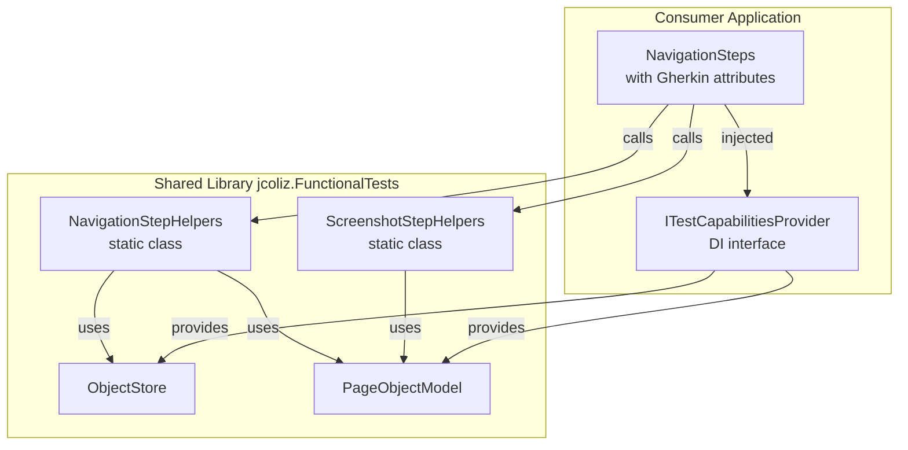

# Shared Step Library Architecture - Final Recommendation

## Executive Summary

**Problem:** Several application-independent step methods in [`NavigationSteps.cs`](Tests.Functional/Steps/NavigationSteps.cs) should move to the shared [`jcoliz.FunctionalTests`](submodules/jcoliz.FunctionalTests) library, but cannot use Gherkin.Generator attributes due to version dependencies.

**Solution:** ⭐ **Static Helper Classes** with explicit dependencies

**Key Constraint:** [`ITestCapabilitiesProvider`](Tests.Functional/Infrastructure/FunctionalTestBase.cs:16) is application-specific and cannot move to the shared library.

## Recommended Architecture

### Static Helper Pattern

Create static helper classes in the shared library that accept primitive dependencies ([`ObjectStore`](submodules/jcoliz.FunctionalTests/src/FunctionalTests/ObjectStore.cs), [`PageObjectModel`](submodules/jcoliz.FunctionalTests/src/FunctionalTests/PageObjectModel.cs)) rather than application-specific interfaces.



## Implementation Examples

### In Shared Library: NavigationStepHelpers.cs

```csharp
namespace jcoliz.FunctionalTests.Helpers;

/// <summary>
/// Helper methods for common navigation step operations
/// </summary>
public static class NavigationStepHelpers
{
    /// <summary>
    /// Launches the site root and stores the navigation response
    /// </summary>
    /// <param name="objectStore">Object store for sharing state between steps</param>
    /// <param name="pageModel">Page object model for the current page</param>
    public static async Task LaunchSiteAsync(ObjectStore objectStore, PageObjectModel pageModel)
    {
        var result = await pageModel.LaunchSite();
        objectStore.Add(result!);
    }
    
    /// <summary>
    /// Asserts that the page loaded successfully (HTTP 200)
    /// </summary>
    /// <param name="objectStore">Object store containing the IResponse from navigation</param>
    /// <exception cref="AssertionException">Thrown if response is not OK</exception>
    public static Task AssertPageLoadedOkAsync(ObjectStore objectStore)
    {
        var response = objectStore.Get<IResponse>();
        Assert.That(response!.Ok, Is.True, "Expected page to load successfully");
        return Task.CompletedTask;
    }
    
    /// <summary>
    /// Waits for the page to fully load (for screenshots, etc.)
    /// </summary>
    /// <param name="pageModel">Page object model for the current page</param>
    public static async Task WaitForPageFullyLoadedAsync(PageObjectModel pageModel)
    {
        await pageModel.WaitUntilLoaded();
    }
}
```

### In Shared Library: ScreenshotStepHelpers.cs

```csharp
namespace jcoliz.FunctionalTests.Helpers;

/// <summary>
/// Helper methods for screenshot capture operations
/// </summary>
public static class ScreenshotStepHelpers
{
    /// <summary>
    /// Saves a screenshot with an optional moment identifier
    /// </summary>
    /// <param name="pageModel">Page object model for the current page</param>
    /// <param name="moment">Optional moment identifier for the filename</param>
    /// <param name="fullPage">Whether to capture full page or just viewport</param>
    public static async Task SaveScreenshotAsync(
        PageObjectModel pageModel, 
        string? moment = null, 
        bool fullPage = true)
    {
        await pageModel.SaveScreenshotAsync(moment: moment, fullPage: fullPage);
    }
    
    /// <summary>
    /// Saves a screenshot with a specific name (viewport only)
    /// </summary>
    /// <param name="pageModel">Page object model for the current page</param>
    /// <param name="name">Name identifier for the screenshot</param>
    public static async Task SaveScreenshotNamedAsync(PageObjectModel pageModel, string name)
    {
        await pageModel.SaveScreenshotAsync(moment: name, fullPage: false);
    }
}
```

### In Consumer Application: Updated NavigationSteps.cs

```csharp
using Gherkin.Generator.Utils;
using jcoliz.FunctionalTests;
using jcoliz.FunctionalTests.Helpers; // Import helpers
using ListsWebApp.Tests.Functional.Infrastructure;
using ListsWebApp.Tests.Functional.Pages;

namespace ListsWebApp.Tests.Functional.Steps;

public class NavigationSteps
{
    private readonly ITestCapabilitiesProvider _context;
    
    public NavigationSteps(ITestCapabilitiesProvider context) => _context = context;

    #region Site Launch - Using Shared Helpers ✨
    
    [Given("user has launched the site")]
    public async Task UserHasLaunchedTheSite()
    {
        await WhenUserLaunchesSite();
        await ThenPageLoadedOk();
    }

    [When("user launches the site")]
    [When("user navigates to the site index")]
    public async Task WhenUserLaunchesSite()
    {
        var page = _context.GetOrCreatePage<PageObjectModel>();
        await NavigationStepHelpers.LaunchSiteAsync(_context.ObjectStore, page);
    }
    
    #endregion

    #region Page State - Using Shared Helpers ✨
    
    [When("page has fully loaded")]
    public async Task PageHasFullyLoaded()
    {
        var page = _context.GetOrCreatePage<PageObjectModel>();
        await NavigationStepHelpers.WaitForPageFullyLoadedAsync(page);
    }
    
    #endregion

    #region Assertions - Using Shared Helpers ✨
    
    [Then("page loaded ok")]
    public async Task ThenPageLoadedOk()
    {
        await NavigationStepHelpers.AssertPageLoadedOkAsync(_context.ObjectStore);
    }
    
    #endregion

    #region Screenshots - Using Shared Helpers ✨
    
    [Then("save a screenshot")]
    public async Task SaveAScreenshot()
    {
        var page = _context.GetOrCreatePage<PageObjectModel>();
        await ScreenshotStepHelpers.SaveScreenshotAsync(page);
    }

    [Then("save a screenshot named {Name}")]
    public async Task SaveAScreenshotNamed(string name)
    {
        var page = _context.GetOrCreatePage<PageObjectModel>();
        await ScreenshotStepHelpers.SaveScreenshotNamedAsync(page, name);
    }
    
    #endregion
    
    #region Application-Specific Steps (Unchanged)
    
    [When("user navigates to {name} page")]
    public async Task UserNavigatesToAnyPage(string name)
    {
        // Application-specific logic remains here
        BasePage model = name switch
        {
            "Login" => _context.GetOrCreatePage<LoginPage>(),
            "Lists" => _context.GetOrCreatePage<ListsPage>(),
            "ImportExport" => _context.GetOrCreatePage<ImportExportPage>(),
            "Logs" => _context.GetOrCreatePage<LogsPage>(),
            "Profile" => _context.GetOrCreatePage<ProfilePage>(),
            "Browse" => _context.GetOrCreatePage<ViewsPage>(),
            "Manage" => _context.GetOrCreatePage<ManagePage>(),
            _ => throw new NotImplementedException($"Navigation to page '{name}' is not implemented.")
        };
        
        var result = await model.NavigateToUrlAsync();
        _context.ObjectStore.Add(result!);
    }
    
    #endregion
}
```

## Why This Approach Works

### ✅ Benefits

1. **Version Independence** - No Gherkin.Generator dependency in shared library
2. **Application Agnostic** - No coupling to `ITestCapabilitiesProvider`
3. **Clean Separation** - Library provides functionality, consumer adds DSL
4. **No Inheritance Conflicts** - Works with any DI pattern
5. **Explicit Dependencies** - Methods declare exactly what they need
6. **Easy to Test** - Pure static methods
7. **Composable** - Can be called from any step class
8. **Flexible** - Consumers control attribute placement and method naming

### Methods to Migrate

From [`NavigationSteps.cs`](Tests.Functional/Steps/NavigationSteps.cs:31):

| Current Method | Helper Class | Helper Method |
|----------------|--------------|---------------|
| [`WhenUserLaunchesSite()`](Tests.Functional/Steps/NavigationSteps.cs:31) | `NavigationStepHelpers` | `LaunchSiteAsync()` |
| [`ThenPageLoadedOk()`](Tests.Functional/Steps/NavigationSteps.cs:165) | `NavigationStepHelpers` | `AssertPageLoadedOkAsync()` |
| [`PageHasFullyLoaded()`](Tests.Functional/Steps/NavigationSteps.cs:137) | `NavigationStepHelpers` | `WaitForPageFullyLoadedAsync()` |
| [`SaveAScreenshot()`](Tests.Functional/Steps/NavigationSteps.cs:201) | `ScreenshotStepHelpers` | `SaveScreenshotAsync()` |
| [`SaveAScreenshotNamed()`](Tests.Functional/Steps/NavigationSteps.cs:211) | `ScreenshotStepHelpers` | `SaveScreenshotNamedAsync()` |

## Implementation Plan

### Phase 1: Create Helper Classes (Shared Library)

1. **Create `NavigationStepHelpers.cs`:**
   - `LaunchSiteAsync(ObjectStore, PageObjectModel)`
   - `AssertPageLoadedOkAsync(ObjectStore)`
   - `WaitForPageFullyLoadedAsync(PageObjectModel)`

2. **Create `ScreenshotStepHelpers.cs`:**
   - `SaveScreenshotAsync(PageObjectModel, string?, bool)`
   - `SaveScreenshotNamedAsync(PageObjectModel, string)`

3. **Add Documentation:**
   - Comprehensive XML docs for each method
   - Usage examples in README
   - Migration guide

### Phase 2: Refactor Consumer (Optional)

1. **Update [`NavigationSteps.cs`](Tests.Functional/Steps/NavigationSteps.cs):**
   - Add `using jcoliz.FunctionalTests.Helpers;`
   - Replace method implementations with helper calls
   - Keep Gherkin attributes unchanged

2. **Verify:**
   - Run all functional tests
   - Confirm Gherkin discovery works
   - No behavioral changes

### Phase 3: Expand

1. **Identify Additional Helpers:**
   - Look for cross-cutting patterns
   - Extract reusable logic
   - Create new helper classes as needed

2. **Iterate:**
   - Gather community feedback
   - Refine signatures for usability
   - Add helpers based on demand

## Alternative Approaches Considered

| Approach | Pros | Cons | Verdict |
|----------|------|------|---------|
| **Base Classes** | Structured inheritance | Conflicts with DI pattern | ❌ Rejected |
| **Extension Methods** | Familiar C# pattern | Still requires interface in library | ❌ Incompatible |
| **Weak Gherkin Dependency** | Zero boilerplate | Version lock, framework coupling | ❌ Violates goals |
| **Separate Gherkin Package** | Clean separation | Extra maintenance overhead | ⚠️ Future consideration |
| **Static Helpers** ⭐ | Simple, flexible, version-independent | Thin wrappers needed | ✅ **Recommended** |

## Migration Impact

### For Shared Library

- **Add**: 2 new helper classes (~100 LOC)
- **Dependencies**: None (uses existing [`ObjectStore`](submodules/jcoliz.FunctionalTests/src/FunctionalTests/ObjectStore.cs), [`PageObjectModel`](submodules/jcoliz.FunctionalTests/src/FunctionalTests/PageObjectModel.cs))
- **Breaking Changes**: None

### For Consumer Application

- **Modify**: [`NavigationSteps.cs`](Tests.Functional/Steps/NavigationSteps.cs) (~5 methods)
- **Add**: 1 using statement
- **Breaking Changes**: None (internal refactoring only)
- **Test Impact**: Zero (same behavior, different implementation)

## Success Criteria

✅ No Gherkin.Generator dependency in shared library  
✅ All existing tests pass without modification  
✅ Gherkin step discovery continues to work  
✅ Methods can be reused across multiple consumers  
✅ Clear documentation and examples provided  

## Next Actions

1. **Review & Approve** this architecture plan
2. **Implement** helper classes in shared library
3. **Test** with consumer application
4. **Document** in shared library README
5. **Consider** additional helper categories based on usage patterns

## Questions for Final Review

1. ✅ Does the static helper approach meet your requirements?
2. ✅ Are there other step categories that would benefit from this pattern?
3. ✅ Should we create helpers for other commonly used step patterns?
4. ✅ What naming convention preference: `*Helpers` vs `*Utilities` vs `*Steps`?

---

**Status:** Ready for implementation  
**Last Updated:** 2026-03-18  
**Decision:** Static Helper Classes (Version-Independent, Application-Agnostic)
