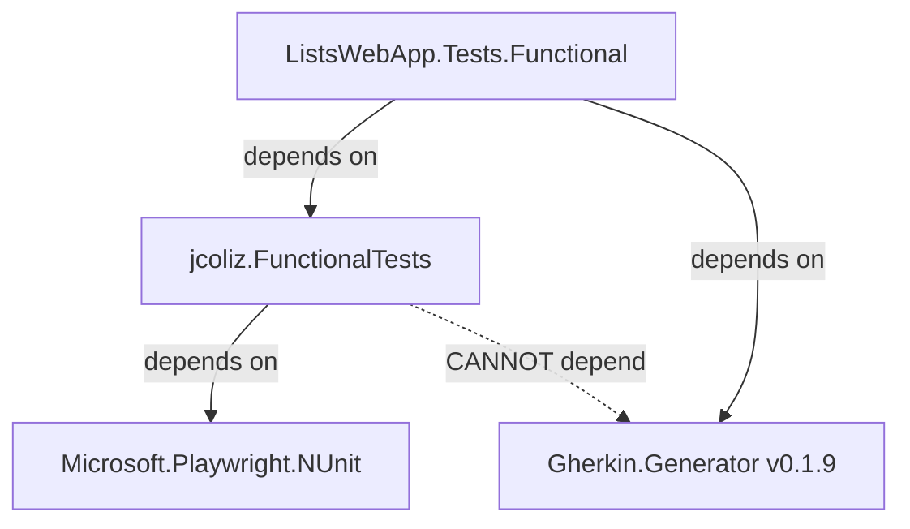
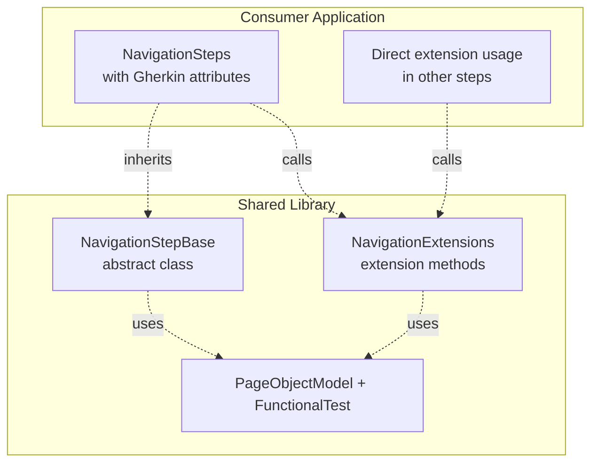
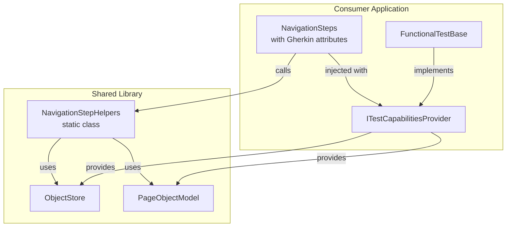

# Shared Step Library Architecture Plan

## Problem Statement

Several step methods in [`NavigationSteps.cs`](Tests.Functional/Steps/NavigationSteps.cs) are application-independent and would be valuable in the shared [`jcoliz.FunctionalTests`](submodules/jcoliz.FunctionalTests) library:

- [`WhenUserLaunchesSite()`](Tests.Functional/Steps/NavigationSteps.cs:31) - Launches the site root
- [`ThenPageLoadedOk()`](Tests.Functional/Steps/NavigationSteps.cs:165) - Asserts page loaded successfully  
- [`PageHasFullyLoaded()`](Tests.Functional/Steps/NavigationSteps.cs:137) - Waits for page load completion
- [`SaveAScreenshot()`](Tests.Functional/Steps/NavigationSteps.cs:201) - Captures screenshots
- [`SaveAScreenshotNamed()`](Tests.Functional/Steps/NavigationSteps.cs:211) - Named screenshots

**The Challenge:** These methods need Gherkin.Generator attributes (`[When]`, `[Given]`, `[Then]`) to be discoverable as steps, but adding a dependency on Gherkin.Generator to the shared library would impose a specific version constraint on all consumers.

## Current Architecture



### Key Files

- **Application Steps**: [`Tests.Functional/Steps/NavigationSteps.cs`](Tests.Functional/Steps/NavigationSteps.cs) - Contains step definitions with Gherkin attributes
- **Shared Base Classes**: 
  - [`FunctionalTest`](submodules/jcoliz.FunctionalTests/src/FunctionalTests/FunctionalTest.cs) - Base test class with setup/teardown
  - [`PageObjectModel`](submodules/jcoliz.FunctionalTests/src/FunctionalTests/PageObjectModel.cs) - Base page object with common functionality
- **Test Capabilities**: [`ITestCapabilitiesProvider`](Tests.Functional/Infrastructure/FunctionalTestBase.cs:16) - Interface for dependency injection into step classes

## Solution Approaches Evaluated

### Option 1: Base Step Class with Protected Methods ⭐ RECOMMENDED

**Concept:** Provide abstract base step classes in the shared library with protected utility methods. Consumers inherit and add Gherkin attributes.

```csharp
// In jcoliz.FunctionalTests library
public abstract class NavigationStepBase
{
    protected ITestCapabilitiesProvider Context { get; }
    
    protected NavigationStepBase(ITestCapabilitiesProvider context)
    {
        Context = context;
    }
    
    protected async Task LaunchSiteAsync()
    {
        var pageModel = Context.GetOrCreatePage<PageObjectModel>();
        var result = await pageModel.LaunchSite();
        Context.ObjectStore.Add(result!);
    }
    
    protected Task AssertPageLoadedOkAsync()
    {
        var response = Context.ObjectStore.Get<IResponse>();
        Assert.That(response!.Ok, Is.True);
        return Task.CompletedTask;
    }
}

// In application Tests.Functional
public class NavigationSteps : NavigationStepBase
{
    public NavigationSteps(ITestCapabilitiesProvider context) : base(context) { }
    
    [When("user launches the site")]
    public async Task WhenUserLaunchesSite() => await LaunchSiteAsync();
    
    [Then("page loaded ok")]
    public async Task ThenPageLoadedOk() => await AssertPageLoadedOkAsync();
}
```

**Pros:**
- ✅ No dependency on Gherkin.Generator in shared library
- ✅ Clean separation: library provides functionality, consumer adds DSL
- ✅ Flexible - consumers can customize/override behavior
- ✅ Multiple inheritance possible for different step categories

**Cons:**
- ⚠️ Requires thin wrapper methods in consumer code
- ⚠️ More verbose than direct annotation

### Option 2: Extension Methods on ITestCapabilitiesProvider

**Concept:** Provide extension methods that step classes can call.

```csharp
// In jcoliz.FunctionalTests library
public static class NavigationExtensions
{
    public static async Task LaunchSiteAsync(this ITestCapabilitiesProvider context)
    {
        var pageModel = context.GetOrCreatePage<PageObjectModel>();
        var result = await pageModel.LaunchSite();
        context.ObjectStore.Add(result!);
    }
}

// In application Tests.Functional
public class NavigationSteps
{
    private readonly ITestCapabilitiesProvider _context;
    
    [When("user launches the site")]
    public async Task WhenUserLaunchesSite() => await _context.LaunchSiteAsync();
}
```

**Pros:**
- ✅ No dependency on Gherkin.Generator
- ✅ Composable - can mix multiple extension classes
- ✅ Familiar C# pattern

**Cons:**
- ⚠️ Still requires wrapper methods
- ⚠️ Less discoverable than base classes
- ⚠️ Requires `ITestCapabilitiesProvider` interface in shared library

### Option 3: Weak Gherkin Dependency (Not Recommended)

**Concept:** Add Gherkin.Generator to shared library but use broad version range.

```xml
<!-- In jcoliz.FunctionalTests.csproj -->
<PackageReference Include="Gherkin.Generator" Version="*" />
```

**Pros:**
- ✅ Steps work immediately without wrappers
- ✅ Zero boilerplate in consumer

**Cons:**
- ❌ Imposes Gherkin.Generator on all consumers (even non-Gherkin users)
- ❌ Version conflicts if consumer needs different major version
- ❌ Library becomes coupled to specific test framework
- ❌ Violates single responsibility - library dictates DSL

### Option 4: Separate Gherkin Extension Package

**Concept:** Create `jcoliz.FunctionalTests.Gherkin` with pre-annotated steps.

```
jcoliz.FunctionalTests          - Core (no Gherkin)
jcoliz.FunctionalTests.Gherkin  - Gherkin steps (depends on both)
```

**Pros:**
- ✅ Clean separation of concerns
- ✅ Optional Gherkin support
- ✅ Ready-to-use steps for Gherkin users

**Cons:**
- ⚠️ Requires maintaining separate package
- ⚠️ Still version-locks Gherkin users (though they opt in)
- ⚠️ More complex project structure

## Recommended Solution: Hybrid Approach

Combine **Option 1 (Base Classes)** with **Option 2 (Extensions)** for maximum flexibility:

### Architecture Design



### Implementation Structure

**In `jcoliz.FunctionalTests` library:**

1. **Core Base Class**: [`NavigationStepBase`](submodules/jcoliz.FunctionalTests/src/FunctionalTests/NavigationStepBase.cs)
   - Protected methods for common navigation operations
   - No Gherkin dependencies

2. **Extension Methods**: [`NavigationExtensions`](submodules/jcoliz.FunctionalTests/src/FunctionalTests/NavigationExtensions.cs)
   - Public extensions on `ITestCapabilitiesProvider`
   - Same functionality as base class methods
   - Allows ad-hoc usage without inheritance

3. **Additional Base Classes**: [`AssertionStepBase`](submodules/jcoliz.FunctionalTests/src/FunctionalTests/AssertionStepBase.cs), [`ScreenshotStepBase`](submodules/jcoliz.FunctionalTests/src/FunctionalTests/ScreenshotStepBase.cs)
   - Separate base classes for different step categories
   - Allows multiple inheritance via composition

**In consumer application:**

```csharp
public class NavigationSteps : NavigationStepBase
{
    public NavigationSteps(ITestCapabilitiesProvider context) : base(context) { }
    
    // Thin wrappers with Gherkin attributes
    [When("user launches the site")]
    public async Task WhenUserLaunchesSite() => await LaunchSiteAsync();
    
    [Then("page loaded ok")]
    public async Task ThenPageLoadedOk() => await AssertPageLoadedOkAsync();
    
    // Application-specific steps remain unchanged
    [When("user navigates to {name} page")]
    public async Task UserNavigatesToAnyPage(string name) { /* ... */ }
}
```

### Benefits of Hybrid Approach

1. **Multiple Usage Patterns:**
   - Inherit base class for step definitions
   - Call extensions directly from any step class
   - Mix and match as needed

2. **Progressive Enhancement:**
   - Start with extensions for quick prototyping
   - Refactor to base classes for better organization
   - No breaking changes

3. **Future-Proof:**
   - Library remains test-framework agnostic
   - Can add support for other frameworks (SpecFlow, etc.)
   - Consumers control their DSL

## Implementation Plan

### Phase 1: Move Core Logic to Shared Library

1. **Create Base Step Classes:**
   - `NavigationStepBase` - Site launch, page navigation utilities
   - `AssertionStepBase` - Page load assertions
   - `ScreenshotStepBase` - Screenshot capture functionality

2. **Create Extension Methods:**
   - Mirror base class methods as extensions
   - Provide standalone utility functions

3. **Update Shared Library Dependencies:**
   - Ensure `ITestCapabilitiesProvider` is available (might need to move to library)
   - Add necessary interfaces for page object access

### Phase 2: Refactor Consumer Application

1. **Update NavigationSteps:**
   - Inherit from `NavigationStepBase`
   - Replace method bodies with base class calls
   - Keep Gherkin attributes in place

2. **Test Compatibility:**
   - Verify all existing tests pass
   - Ensure Gherkin discovery still works

3. **Refactor Other Step Classes:**
   - Use extensions for one-off shared functionality
   - Consider additional base classes as patterns emerge

### Phase 3: Documentation and Examples

1. **Update Library README:**
   - Document base class pattern
   - Provide extension method examples
   - Show how to combine approaches

2. **Create Migration Guide:**
   - Help existing consumers adopt new patterns
   - Code samples and best practices

## Interface Considerations ⚠️

### ITestCapabilitiesProvider is Application-Specific

**Key Constraint:** [`ITestCapabilitiesProvider`](Tests.Functional/Infrastructure/FunctionalTestBase.cs:16) is **application-specific** and cannot be moved to the shared library. This fundamentally changes our approach.

### Revised Solution: Static Helper Methods ⭐ RECOMMENDED

Use **static helper classes** that accept primitive dependencies, avoiding the need for application-specific interfaces.

```csharp
// In jcoliz.FunctionalTests library
public static class NavigationStepHelpers
{
    /// <summary>
    /// Launches the site root and stores the response
    /// </summary>
    public static async Task LaunchSiteAsync(ObjectStore objectStore, PageObjectModel pageModel)
    {
        var result = await pageModel.LaunchSite();
        objectStore.Add(result!);
    }
    
    /// <summary>
    /// Asserts that the page loaded successfully
    /// </summary>
    public static Task AssertPageLoadedOkAsync(ObjectStore objectStore)
    {
        var response = objectStore.Get<IResponse>();
        Assert.That(response!.Ok, Is.True);
        return Task.CompletedTask;
    }
    
    /// <summary>
    /// Saves a named screenshot
    /// </summary>
    public static async Task SaveScreenshotNamedAsync(PageObjectModel pageModel, string name)
    {
        await pageModel.SaveScreenshotAsync(moment: name, fullPage: false);
    }
    
    /// <summary>
    /// Waits for page to fully load
    /// </summary>
    public static async Task WaitForPageFullyLoadedAsync(PageObjectModel pageModel)
    {
        await pageModel.WaitUntilLoaded();
    }
}
```

**Usage in consumer application:**

```csharp
// In application Tests.Functional
public class NavigationSteps
{
    private readonly ITestCapabilitiesProvider _context;
    
    public NavigationSteps(ITestCapabilitiesProvider context) => _context = context;
    
    [When("user launches the site")]
    public async Task WhenUserLaunchesSite()
    {
        var page = _context.GetOrCreatePage<PageObjectModel>();
        await NavigationStepHelpers.LaunchSiteAsync(_context.ObjectStore, page);
    }
    
    [Then("page loaded ok")]
    public async Task ThenPageLoadedOk()
    {
        await NavigationStepHelpers.AssertPageLoadedOkAsync(_context.ObjectStore);
    }
    
    [Then("save a screenshot named {Name}")]
    public async Task SaveAScreenshotNamed(string name)
    {
        var page = _context.GetOrCreatePage<PageObjectModel>();
        await NavigationStepHelpers.SaveScreenshotNamedAsync(page, name);
    }
    
    [When("page has fully loaded")]
    public async Task PageHasFullyLoaded()
    {
        var page = _context.GetOrCreatePage<PageObjectModel>();
        await NavigationStepHelpers.WaitForPageFullyLoadedAsync(page);
    }
}
```

### Why Static Helpers Work Best

1. **No Inheritance Issues**: Step classes continue to use dependency injection
2. **Clear Dependencies**: Methods explicitly declare what they need ([`ObjectStore`](submodules/jcoliz.FunctionalTests/src/FunctionalTests/ObjectStore.cs), [`PageObjectModel`](submodules/jcoliz.FunctionalTests/src/FunctionalTests/PageObjectModel.cs))
3. **Application Agnostic**: No coupling to `ITestCapabilitiesProvider`
4. **Easy to Test**: Pure static methods with explicit inputs
5. **Composable**: Can be called from any step class
6. **No Base Class Conflicts**: Works with any test framework pattern

### Updated Architecture Diagram



## Trade-offs Summary

| Approach | Shared Code Reuse | Version Independence | Ease of Use | Maintenance |
|----------|-------------------|---------------------|-------------|-------------|
| Base Classes | ⭐⭐⭐⭐⭐ | ⭐⭐⭐⭐⭐ | ⭐⭐⭐ | ⭐⭐⭐⭐ |
| Extensions | ⭐⭐⭐⭐ | ⭐⭐⭐⭐⭐ | ⭐⭐⭐⭐ | ⭐⭐⭐⭐ |
| Weak Dependency | ⭐⭐⭐⭐⭐ | ⭐ | ⭐⭐⭐⭐⭐ | ⭐⭐ |
| Separate Package | ⭐⭐⭐⭐⭐ | ⭐⭐⭐ | ⭐⭐⭐⭐⭐ | ⭐⭐ |

## Decision: Proceed with Base Classes + Extensions

The hybrid approach provides:
- Maximum flexibility for consumers
- Version independence preserved
- Clean architecture that scales
- Progressive adoption path

## Next Steps

1. **Review and Approve** - Discuss this plan with stakeholders
2. **Prioritize Methods** - Identify which methods provide most value
3. **Prototype** - Create one base class to validate approach
4. **Implement** - Follow phased implementation plan
5. **Document** - Update library documentation with patterns

## Questions for Consideration

1. Should `ITestCapabilitiesProvider` move to the shared library or remain application-specific?
2. Are there other step categories beyond Navigation that would benefit from this pattern?
3. Should we create a migration tool/script to help update existing step classes?
4. What naming convention should we use for base classes? (`*StepBase`, `*Steps`, `*StepHelpers`)?

---

**Status:** Ready for review
**Last Updated:** 2026-03-18
