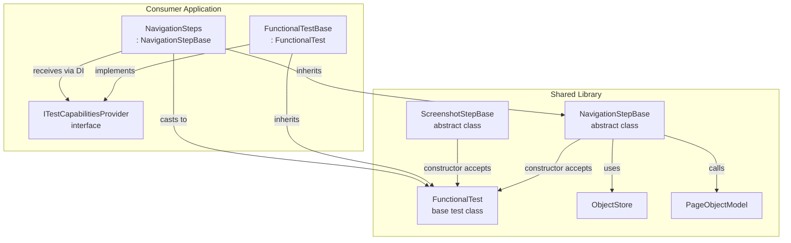

# Base Class Approach with FunctionalTest Constructor

## Insight from User

> "Why not have NavigationStepBase accept FunctionalTest as its constructor parameter? The inherited class will construct with something that inherits from FunctionalTest."

This is **brilliant** and solves the dependency issue perfectly! ⭐

## The Pattern

### In Shared Library: NavigationStepBase.cs

```csharp
namespace jcoliz.FunctionalTests.Steps;

/// <summary>
/// Base class for navigation step definitions with common operations
/// </summary>
/// <remarks>
/// Inherit from this class and add Gherkin/SpecFlow attributes to expose steps.
/// Constructor accepts a FunctionalTest instance (or derived class) to access test capabilities.
/// </remarks>
public abstract class NavigationStepBase
{
    protected FunctionalTest Test { get; }
    
    protected NavigationStepBase(FunctionalTest test)
    {
        Test = test;
    }
    
    /// <summary>
    /// Launches the site root and stores the navigation response
    /// </summary>
    protected async Task LaunchSiteAsync()
    {
        var pageModel = Test.GetOrCreatePage<PageObjectModel>();
        var result = await pageModel.LaunchSite();
        Test._objectStore.Add(result!);
    }
    
    /// <summary>
    /// Asserts that the page loaded successfully (HTTP 200)
    /// </summary>
    protected Task AssertPageLoadedOkAsync()
    {
        var response = Test._objectStore.Get<IResponse>();
        Assert.That(response!.Ok, Is.True, "Expected page to load successfully");
        return Task.CompletedTask;
    }
    
    /// <summary>
    /// Waits for the page to fully load
    /// </summary>
    protected async Task WaitForPageFullyLoadedAsync()
    {
        var pageModel = Test.GetOrCreatePage<PageObjectModel>();
        await pageModel.WaitUntilLoaded();
    }
}
```

### In Shared Library: ScreenshotStepBase.cs

```csharp
namespace jcoliz.FunctionalTests.Steps;

/// <summary>
/// Base class for screenshot step definitions
/// </summary>
public abstract class ScreenshotStepBase
{
    protected FunctionalTest Test { get; }
    
    protected ScreenshotStepBase(FunctionalTest test)
    {
        Test = test;
    }
    
    /// <summary>
    /// Saves a screenshot with optional moment identifier
    /// </summary>
    protected async Task SaveScreenshotAsync(string? moment = null, bool fullPage = true)
    {
        var pageModel = Test.GetOrCreatePage<PageObjectModel>();
        await pageModel.SaveScreenshotAsync(moment: moment, fullPage: fullPage);
    }
    
    /// <summary>
    /// Saves a screenshot with a specific name (viewport only)
    /// </summary>
    protected async Task SaveScreenshotNamedAsync(string name)
    {
        var pageModel = Test.GetOrCreatePage<PageObjectModel>();
        await pageModel.SaveScreenshotAsync(moment: name, fullPage: false);
    }
}
```

## In Consumer Application: Updated NavigationSteps.cs

```csharp
using Gherkin.Generator.Utils;
using jcoliz.FunctionalTests;
using jcoliz.FunctionalTests.Steps; // Import base classes
using ListsWebApp.Tests.Functional.Infrastructure;
using ListsWebApp.Tests.Functional.Pages;

namespace ListsWebApp.Tests.Functional.Steps;

/// <summary>
/// Step definitions for site launch, page navigation, page state, and assertions
/// </summary>
public class NavigationSteps : NavigationStepBase
{
    private readonly ITestCapabilitiesProvider _context;
    
    // Constructor accepts ITestCapabilitiesProvider which IS-A FunctionalTest
    public NavigationSteps(ITestCapabilitiesProvider context) 
        : base((FunctionalTest)context) // Cast to base class
    {
        _context = context;
    }

    #region Site Launch (Using Base Class) ✨
    
    [Given("user has launched the site")]
    public async Task UserHasLaunchedTheSite()
    {
        await WhenUserLaunchesSite();
        await ThenPageLoadedOk();
    }

    [When("user launches the site")]
    [When("user navigates to the site index")]
    public async Task WhenUserLaunchesSite() => await LaunchSiteAsync();
    
    #endregion

    #region Page State (Using Base Class) ✨
    
    [When("page has fully loaded")]
    public async Task PageHasFullyLoaded() => await WaitForPageFullyLoadedAsync();
    
    [When("reloading the page")]
    public async Task ReloadingThePage()
    {
        // Can still use _context for app-specific functionality
        var pageModel = _context.ObjectStore.Get<BasePage>("CurrentPage");
        await pageModel.ReloadPageAsync();
    }
    
    #endregion

    #region Assertions (Using Base Class) ✨
    
    [Then("page loaded ok")]
    public async Task ThenPageLoadedOk() => await AssertPageLoadedOkAsync();
    
    #endregion
    
    #region Application-Specific Navigation (Local Implementation)
    
    [When("user navigates to {name} page")]
    public async Task UserNavigatesToAnyPage(string name)
    {
        // Application-specific logic uses _context
        BasePage model = name switch
        {
            "Login" => _context.GetOrCreatePage<LoginPage>(),
            "Lists" => _context.GetOrCreatePage<ListsPage>(),
            "ImportExport" => _context.GetOrCreatePage<ImportExportPage>(),
            "Logs" => _context.GetOrCreatePage<LogsPage>(),
            "Profile" => _context.GetOrCreatePage<ProfilePage>(),
            "Browse" => _context.GetOrCreatePage<ViewsPage>(),
            "Manage" => _context.GetOrCreatePage<ManagePage>(),
            _ => throw new NotImplementedException($"Navigation to page '{name}' is not implemented.")
        };
        
        var result = await model.NavigateToUrlAsync();
        _context.ObjectStore.Add(result!);
    }
    
    #endregion
}
```

### Alternative: Multiple Base Classes via Composition

If a step class needs multiple base class capabilities, use composition:

```csharp
public class NavigationSteps
{
    private readonly ITestCapabilitiesProvider _context;
    private readonly NavigationStepBase _navBase;
    private readonly ScreenshotStepBase _screenshotBase;
    
    public NavigationSteps(ITestCapabilitiesProvider context)
    {
        _context = context;
        _navBase = new NavigationStepHelper((FunctionalTest)context);
        _screenshotBase = new ScreenshotStepHelper((FunctionalTest)context);
    }
    
    [When("user launches the site")]
    public async Task WhenUserLaunchesSite() => await _navBase.LaunchSiteAsync();
    
    [Then("save a screenshot")]
    public async Task SaveAScreenshot() => await _screenshotBase.SaveScreenshotAsync();
}
```

## Why This Works Brilliantly

### ✅ Key Advantages

1. **Clean Inheritance** - Natural OOP pattern
2. **Access to FunctionalTest** - Can use `GetOrCreatePage<T>()` and `_objectStore` directly
3. **No Interface Dependency** - Shared library only knows about `FunctionalTest` (which it owns)
4. **Type Safety** - Compile-time verification of cast
5. **Simple API** - Protected methods are clean and intuitive
6. **Flexible** - Can still use `_context` for app-specific needs
7. **Version Independent** - No Gherkin dependency in shared library

### How It Solves the Problem

| Challenge | Solution |
|-----------|----------|
| Need access to test capabilities | Pass `FunctionalTest` to base class |
| `ITestCapabilitiesProvider` is app-specific | Cast at construction time: `(FunctionalTest)context` |
| Multiple step categories | Create multiple base classes, use composition if needed |
| Gherkin attributes | Consumer adds attributes to thin wrapper methods |

## Architecture Diagram



## Comparison: Base Class vs Static Helpers

| Aspect | Base Class | Static Helpers |
|--------|-----------|----------------|
| **Inheritance** | Natural OOP pattern | No inheritance |
| **Access Pattern** | `await LaunchSiteAsync()` | `await Helper.LaunchSiteAsync(store, page)` |
| **Type Safety** | Compile-time via inheritance | Runtime via parameters |
| **Composability** | Via multiple base classes | Natural - call any helper |
| **Discoverability** | IntelliSense shows protected methods | Must know helper exists |
| **Flexibility** | Requires inheritance or composition | Can call from anywhere |
| **Complexity** | Requires cast in constructor | Just call static method |

## Recommendation: Use Base Classes ⭐

Given that `ITestCapabilitiesProvider` inherits from `FunctionalTest`, **base classes are superior**:

1. More natural for step class organization
2. Better IntelliSense support
3. Cleaner syntax (no passing parameters)
4. Follows established testing patterns

**When to use Static Helpers instead:**
- When step class already inherits from something else
- When mixing capabilities from many categories
- For one-off utility calls from non-step code

## Implementation Plan (Revised)

### Phase 1: Create Base Classes (Shared Library)

1. **Create `NavigationStepBase`:**
   - Constructor: `NavigationStepBase(FunctionalTest test)`
   - Protected methods:
     - `LaunchSiteAsync()`
     - `AssertPageLoadedOkAsync()`
     - `WaitForPageFullyLoadedAsync()`

2. **Create `ScreenshotStepBase`:**
   - Constructor: `ScreenshotStepBase(FunctionalTest test)`
   - Protected methods:
     - `SaveScreenshotAsync(string?, bool)`
     - `SaveScreenshotNamedAsync(string)`

3. **Documentation:**
   - XML docs explaining constructor pattern
   - Example showing cast from derived type
   - Composition pattern for multiple bases

### Phase 2: Refactor Consumer

1. **Update [`NavigationSteps.cs`](Tests.Functional/Steps/NavigationSteps.cs):**
   - Inherit from `NavigationStepBase`
   - Add cast in constructor: `base((FunctionalTest)context)`
   - Replace method bodies with base class calls
   - Keep Gherkin attributes

2. **Verify:**
   - Compile successfully
   - All tests pass
   - Gherkin discovery works

### Phase 3: Expand Pattern

1. **Create Additional Base Classes:**
   - `AssertionStepBase` - Common assertions
   - `PageStateStepBase` - Page state management
   - As patterns emerge

2. **Document Patterns:**
   - Single inheritance pattern
   - Composition pattern for multiple bases
   - When to use base vs helpers

## Final Code Example

### Shared Library Structure

```
jcoliz.FunctionalTests/
├── FunctionalTest.cs
├── PageObjectModel.cs
├── ObjectStore.cs
└── Steps/
    ├── NavigationStepBase.cs
    ├── ScreenshotStepBase.cs
    └── README.md (usage guide)
```

### Consumer Usage

```csharp
// Single base class
public class NavigationSteps : NavigationStepBase
{
    public NavigationSteps(ITestCapabilitiesProvider ctx) : base((FunctionalTest)ctx) { }
    
    [When("user launches the site")]
    public async Task Launch() => await LaunchSiteAsync();
}

// Composition for multiple bases
public class MultiSteps
{
    private readonly NavigationStepBase _nav;
    private readonly ScreenshotStepBase _screenshot;
    
    public MultiSteps(ITestCapabilitiesProvider ctx)
    {
        var test = (FunctionalTest)ctx;
        _nav = new NavigationStepHelper(test);
        _screenshot = new ScreenshotStepHelper(test);
    }
    
    [When("launching and capturing")]
    public async Task LaunchAndCapture()
    {
        await _nav.LaunchSiteAsync();
        await _screenshot.SaveScreenshotAsync("after-launch");
    }
}
```

## Conclusion

The base class approach with `FunctionalTest` constructor is **cleaner, more maintainable, and more intuitive** than static helpers for this use case.

**Decision:** ✅ Implement base classes accepting `FunctionalTest` in constructor

---

**Status:** Ready for implementation  
**Last Updated:** 2026-03-18  
**Recommended Approach:** Base Classes with FunctionalTest Constructor Parameter
