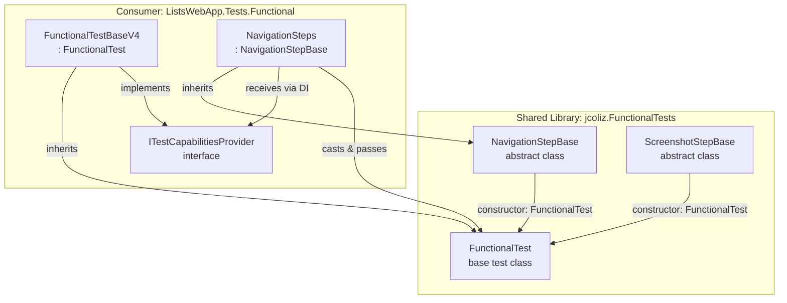

# Shared Step Library - Final Architecture Plan

## Problem Summary

Application-independent step methods in [`NavigationSteps.cs`](Tests.Functional/Steps/NavigationSteps.cs) should be moved to the shared [`jcoliz.FunctionalTests`](submodules/jcoliz.FunctionalTests) library, but adding Gherkin.Generator attributes would create unwanted version dependencies.

**Methods to Share:**
- [`WhenUserLaunchesSite()`](Tests.Functional/Steps/NavigationSteps.cs:31) - Launch site root
- [`ThenPageLoadedOk()`](Tests.Functional/Steps/NavigationSteps.cs:165) - Assert successful page load
- [`PageHasFullyLoaded()`](Tests.Functional/Steps/NavigationSteps.cs:137) - Wait for page load completion
- [`SaveAScreenshot()`](Tests.Functional/Steps/NavigationSteps.cs:201) - Capture screenshot
- [`SaveAScreenshotNamed()`](Tests.Functional/Steps/NavigationSteps.cs:211) - Named screenshot capture

## Recommended Solution ⭐

**Abstract Base Classes with FunctionalTest Constructor**

Create abstract base classes in the shared library that accept [`FunctionalTest`](submodules/jcoliz.FunctionalTests/src/FunctionalTests/FunctionalTest.cs) as a constructor parameter. Consumer step classes inherit from these bases and add Gherkin attributes.

### Architecture



### Key Insight

[`ITestCapabilitiesProvider`](Tests.Functional/Infrastructure/FunctionalTestBase.cs:16) is implemented by [`FunctionalTestBaseV4`](Tests.Functional/Infrastructure/FunctionalTestBase.cs:51), which **inherits from** [`FunctionalTest`](submodules/jcoliz.FunctionalTests/src/FunctionalTests/FunctionalTest.cs). This allows casting at construction time without modifying interfaces.

## Implementation Examples

### In Shared Library: NavigationStepBase.cs

```csharp
namespace jcoliz.FunctionalTests.Steps;

/// <summary>
/// Base class for navigation step definitions providing common operations
/// </summary>
/// <remarks>
/// Inherit from this class and add test framework attributes (Gherkin, SpecFlow, etc.) 
/// to the wrapper methods. Constructor accepts FunctionalTest or any derived class.
/// </remarks>
public abstract class NavigationStepBase
{
    protected FunctionalTest Test { get; }
    
    /// <summary>
    /// Initializes the navigation step base with test capabilities
    /// </summary>
    /// <param name="test">FunctionalTest instance providing page access and object store</param>
    protected NavigationStepBase(FunctionalTest test)
    {
        Test = test;
    }
    
    /// <summary>
    /// Launches the site root ("/") and stores the navigation response in the object store
    /// </summary>
    protected async Task LaunchSiteAsync()
    {
        var pageModel = Test.GetOrCreatePage<PageObjectModel>();
        var result = await pageModel.LaunchSite();
        Test._objectStore.Add(result!);
    }
    
    /// <summary>
    /// Asserts that the last navigation resulted in a successful HTTP response
    /// </summary>
    /// <exception cref="AssertionException">Thrown if response.Ok is false</exception>
    protected Task AssertPageLoadedOkAsync()
    {
        var response = Test._objectStore.Get<IResponse>();
        Assert.That(response!.Ok, Is.True, "Expected page to load successfully (HTTP 200)");
        return Task.CompletedTask;
    }
    
    /// <summary>
    /// Waits for the page to finish loading (useful before taking screenshots)
    /// </summary>
    protected async Task WaitForPageFullyLoadedAsync()
    {
        var pageModel = Test.GetOrCreatePage<PageObjectModel>();
        await pageModel.WaitUntilLoaded();
    }
}
```

### In Shared Library: ScreenshotStepBase.cs

```csharp
namespace jcoliz.FunctionalTests.Steps;

/// <summary>
/// Base class for screenshot capture step definitions
/// </summary>
public abstract class ScreenshotStepBase
{
    protected FunctionalTest Test { get; }
    
    /// <summary>
    /// Initializes the screenshot step base with test capabilities
    /// </summary>
    /// <param name="test">FunctionalTest instance providing page access</param>
    protected ScreenshotStepBase(FunctionalTest test)
    {
        Test = test;
    }
    
    /// <summary>
    /// Saves a screenshot with optional moment identifier
    /// </summary>
    /// <param name="moment">Optional identifier for the screenshot filename</param>
    /// <param name="fullPage">True to capture full page, false for viewport only</param>
    protected async Task SaveScreenshotAsync(string? moment = null, bool fullPage = true)
    {
        var pageModel = Test.GetOrCreatePage<PageObjectModel>();
        await pageModel.SaveScreenshotAsync(moment: moment, fullPage: fullPage);
    }
    
    /// <summary>
    /// Saves a named screenshot of the current viewport
    /// </summary>
    /// <param name="name">Screenshot name for identification</param>
    protected async Task SaveScreenshotNamedAsync(string name)
    {
        var pageModel = Test.GetOrCreatePage<PageObjectModel>();
        await pageModel.SaveScreenshotAsync(moment: name, fullPage: false);
    }
}
```

### In Consumer: Updated NavigationSteps.cs

```csharp
using Gherkin.Generator.Utils;
using jcoliz.FunctionalTests;
using jcoliz.FunctionalTests.Steps;
using ListsWebApp.Tests.Functional.Infrastructure;
using ListsWebApp.Tests.Functional.Pages;

namespace ListsWebApp.Tests.Functional.Steps;

/// <summary>
/// Step definitions for site launch, page navigation, state management, and assertions
/// </summary>
public class NavigationSteps : NavigationStepBase
{
    private readonly ITestCapabilitiesProvider _context;
    
    public NavigationSteps(ITestCapabilitiesProvider context) 
        : base((FunctionalTest)context) // Cast to base class for shared functionality
    {
        _context = context; // Keep for application-specific operations
    }

    #region Site Launch - Using Base Class ✨
    
    [Given("user has launched the site")]
    public async Task UserHasLaunchedTheSite()
    {
        await WhenUserLaunchesSite();
        await ThenPageLoadedOk();
    }

    [When("user launches the site")]
    [When("user navigates to the site index")]
    public async Task WhenUserLaunchesSite() => await LaunchSiteAsync();
    
    #endregion

    #region Page State - Using Base Class ✨
    
    [When("page has fully loaded")]
    public async Task PageHasFullyLoaded() => await WaitForPageFullyLoadedAsync();
    
    [When("reloading the page")]
    public async Task ReloadingThePage()
    {
        // Application-specific: uses CurrentPage from object store
        var pageModel = _context.ObjectStore.Get<BasePage>("CurrentPage");
        await pageModel.ReloadPageAsync();
    }
    
    #endregion

    #region Assertions - Using Base Class ✨
    
    [Then("page loaded ok")]
    public async Task ThenPageLoadedOk() => await AssertPageLoadedOkAsync();
    
    #endregion
    
    #region Application-Specific Navigation
    
    [When("user navigates to {name} page")]
    public async Task UserNavigatesToAnyPage(string name)
    {
        // This logic is application-specific and remains here
        BasePage model = name switch
        {
            "Login" => _context.GetOrCreatePage<LoginPage>(),
            "Lists" => _context.GetOrCreatePage<ListsPage>(),
            "ImportExport" => _context.GetOrCreatePage<ImportExportPage>(),
            "Logs" => _context.GetOrCreatePage<LogsPage>(),
            "Profile" => _context.GetOrCreatePage<ProfilePage>(),
            "Browse" => _context.GetOrCreatePage<ViewsPage>(),
            "Manage" => _context.GetOrCreatePage<ManagePage>(),
            _ => throw new NotImplementedException($"Navigation to page '{name}' is not implemented.")
        };
        
        var result = await model.NavigateToUrlAsync();
        _context.ObjectStore.Add(result!);
    }
    
    #endregion
}
```

### Alternative: Composition for Multiple Base Classes

If a step class needs capabilities from multiple base classes:

```csharp
public class CombinedSteps
{
    private readonly ITestCapabilitiesProvider _context;
    private readonly NavigationStepBase _navigation;
    private readonly ScreenshotStepBase _screenshots;
    
    public CombinedSteps(ITestCapabilitiesProvider context)
    {
        _context = context;
        var test = (FunctionalTest)context;
        
        // Composition: create instances of each base class
        _navigation = new NavigationStepHelper(test);
        _screenshots = new ScreenshotStepHelper(test);
    }
    
    [When("user launches the site")]
    public async Task Launch() => await _navigation.LaunchSiteAsync();
    
    [Then("save a screenshot")]
    public async Task Screenshot() => await _screenshots.SaveScreenshotAsync();
}

// Helper classes (concrete implementations for composition)
internal class NavigationStepHelper : NavigationStepBase
{
    public NavigationStepHelper(FunctionalTest test) : base(test) { }
}

internal class ScreenshotStepHelper : ScreenshotStepBase
{
    public ScreenshotStepHelper(FunctionalTest test) : base(test) { }
}
```

## Why This Approach is Optimal

### ✅ Advantages

1. **Clean Inheritance** - Natural OOP pattern, familiar to developers
2. **Version Independent** - No Gherkin.Generator dependency in shared library
3. **Type Safe** - Compile-time verification of constructor cast
4. **Direct Access** - Base classes use `Test.GetOrCreatePage<T>()` and `Test._objectStore`
5. **IntelliSense Support** - Protected methods appear in IDE autocomplete
6. **Flexible** - Consumer can still use `_context` for app-specific logic
7. **Composable** - Multiple base classes via composition pattern
8. **Framework Agnostic** - Works with Gherkin, SpecFlow, or custom frameworks

### Comparison to Alternatives

| Approach | Code Clarity | Type Safety | Flexibility | IDE Support | Complexity |
|----------|--------------|-------------|-------------|-------------|------------|
| **Base Classes** ⭐ | ⭐⭐⭐⭐⭐ | ⭐⭐⭐⭐⭐ | ⭐⭐⭐⭐ | ⭐⭐⭐⭐⭐ | ⭐⭐⭐⭐ |
| Static Helpers | ⭐⭐⭐ | ⭐⭐⭐ | ⭐⭐⭐⭐⭐ | ⭐⭐⭐ | ⭐⭐⭐⭐⭐ |
| Extension Methods | ⭐⭐⭐⭐ | ⭐⭐⭐⭐ | ⭐⭐⭐⭐ | ⭐⭐⭐⭐ | ⭐⭐⭐ |
| Weak Dependency | ⭐⭐⭐⭐⭐ | ⭐⭐⭐⭐⭐ | ⭐⭐ | ⭐⭐⭐⭐⭐ | ⭐⭐⭐⭐⭐ |

## Implementation Plan

### Phase 1: Create Base Classes (Shared Library)

1. **Add `NavigationStepBase.cs`** to [`jcoliz.FunctionalTests/src/FunctionalTests/Steps/`](submodules/jcoliz.FunctionalTests/src/FunctionalTests/)
   - Constructor accepting `FunctionalTest`
   - Protected methods: `LaunchSiteAsync()`, `AssertPageLoadedOkAsync()`, `WaitForPageFullyLoadedAsync()`
   - Comprehensive XML documentation

2. **Add `ScreenshotStepBase.cs`** to same location
   - Constructor accepting `FunctionalTest`
   - Protected methods: `SaveScreenshotAsync()`, `SaveScreenshotNamedAsync()`
   - XML documentation

3. **Update Library README**
   - Document base class pattern
   - Show constructor cast example
   - Explain composition pattern
   - Provide usage examples

### Phase 2: Refactor Consumer Application

1. **Update [`NavigationSteps.cs`](Tests.Functional/Steps/NavigationSteps.cs)**
   - Add `using jcoliz.FunctionalTests.Steps;`
   - Change class declaration: `public class NavigationSteps : NavigationStepBase`
   - Update constructor: `: base((FunctionalTest)context)`
   - Replace method bodies with base class calls:
     - `WhenUserLaunchesSite()` → `await LaunchSiteAsync()`
     - `ThenPageLoadedOk()` → `await AssertPageLoadedOkAsync()`
     - `PageHasFullyLoaded()` → `await WaitForPageFullyLoadedAsync()`
   - Keep Gherkin attributes unchanged
   - Keep application-specific methods unchanged

2. **Add Screenshot Steps** (if not already present)
   - Either inherit from both (composition) or keep screenshot steps separate
   - Use base class methods for captures

3. **Verify Functionality**
   - Build project successfully
   - Run all functional tests
   - Confirm Gherkin discovery still works
   - Validate no behavioral changes

### Phase 3: Expand and Document

1. **Identify Additional Patterns**
   - Look for other reusable step categories
   - Create additional base classes as needed (e.g., `AssertionStepBase`, `FormInputStepBase`)

2. **Create Migration Guide**
   - Document pattern for other step classes
   - Show before/after examples
   - Explain when to use inheritance vs composition

3. **Gather Feedback**
   - Use in real tests for a sprint
   - Iterate based on developer experience
   - Refine API as needed

## Migration Impact

### Shared Library Changes

- **Add**: 2 new base classes (~150 LOC total)
- **Dependencies**: None new (uses existing [`FunctionalTest`](submodules/jcoliz.FunctionalTests/src/FunctionalTests/FunctionalTest.cs), [`PageObjectModel`](submodules/jcoliz.FunctionalTests/src/FunctionalTests/PageObjectModel.cs), [`ObjectStore`](submodules/jcoliz.FunctionalTests/src/FunctionalTests/ObjectStore.cs))
- **Breaking Changes**: None
- **Version Impact**: None (no new external dependencies)

### Consumer Application Changes

- **Modify**: [`NavigationSteps.cs`](Tests.Functional/Steps/NavigationSteps.cs) - inheritance and method bodies (~5 methods)
- **Add**: 1 using statement
- **Breaking Changes**: None (stepping definitions unchanged)
- **Test Impact**: Zero (same Gherkin steps, same behavior)
- **Risk**: Low (compile-time type safety, easy rollback)

## Success Criteria

✅ No Gherkin.Generator dependency added to shared library  
✅ All existing functional tests pass without modification  
✅ Gherkin step discovery continues to work correctly  
✅ Step methods reusable across multiple consumer projects  
✅ Clear documentation with usage examples  
✅ Type-safe constructor pattern  
✅ IntelliSense shows base class methods  

## File Structure

```
jcoliz.FunctionalTests/
├── src/
│   └── FunctionalTests/
│       ├── FunctionalTest.cs
│       ├── PageObjectModel.cs
│       ├── ObjectStore.cs
│       ├── TestCorrelationContext.cs
│       └── Steps/                    ← NEW
│           ├── NavigationStepBase.cs ← NEW
│           ├── ScreenshotStepBase.cs ← NEW
│           └── README.md              ← NEW (usage guide)
└── jcoliz.FunctionalTests.csproj

ListsWebApp.Tests.Functional/
├── Steps/
│   ├── NavigationSteps.cs           ← MODIFIED (inherit from base)
│   ├── AuthenticationSteps.cs       (unchanged)
│   └── ...
└── Infrastructure/
    └── FunctionalTestBase.cs        (unchanged)
```

## Decision Summary

✅ **Recommended Solution:** Abstract base classes with `FunctionalTest` constructor parameter

**Rationale:**
- Leverages existing inheritance hierarchy (FunctionalTestBaseV4 : FunctionalTest)
- Clean, type-safe, version-independent
- Natural OOP pattern with excellent IDE support
- Flexible enough for composition when needed
- Zero impact on test framework choice

**Next Steps:**
1. Review and approve this architectural plan
2. Create base classes in shared library
3. Refactor consumer NavigationSteps
4. Test and validate
5. Document pattern for future use

---

**Status:** ✅ Architecture finalized - Ready for implementation  
**Last Updated:** 2026-03-18  
**Decision:** Base classes accepting `FunctionalTest` via constructor
