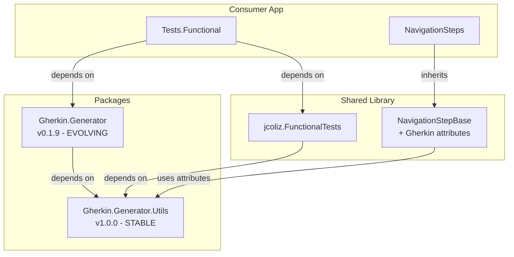
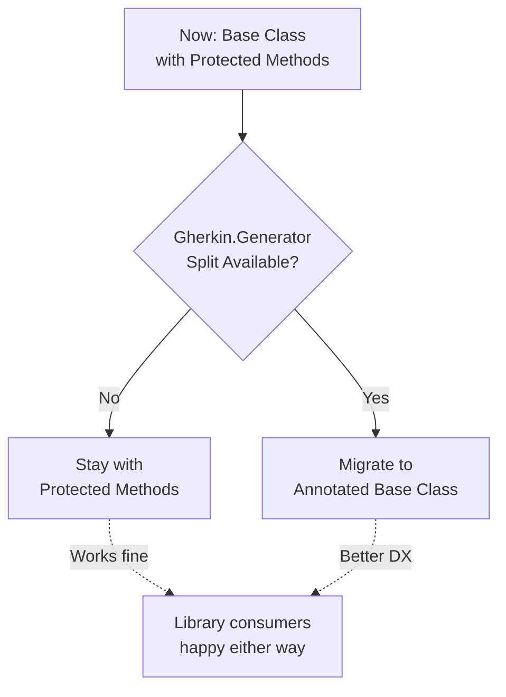

# Alternative Solution: Split Gherkin.Generator Package

## Concept

Rather than avoid Gherkin.Generator entirely in the shared library, **split the package** into stable and volatile components:

- `Gherkin.Generator.Utils` - Stable utilities (attributes, base classes)
- `Gherkin.Generator` - Code generator (source generator, roslyn dependencies)

## Rationale

Looking at the current usage in [`NavigationSteps.cs`](Tests.Functional/Steps/NavigationSteps.cs:1):

```csharp
using Gherkin.Generator.Utils;
```

The step classes **only need the attributes** (`[When]`, `[Given]`, `[Then]`), not the actual code generator. Attributes are:
- Simple data structures
- Rarely change (stable API)
- No complex dependencies
- Binary compatible across versions

## Package Structure

### Gherkin.Generator.Utils (Stable)

**Contains:**
- `[When]`, `[Given]`, `[Then]`, `[And]`, `[But]` attributes
- `[GeneratedTestBase]` attribute
- Parameter parsing utilities
- No Roslyn dependencies
- No source generator code

**Versioning:**
- Semantic versioning with **stable** major version
- Rarely increments (attributes don't change often)
- Binary compatible across minor versions

**Example:** `Gherkin.Generator.Utils 1.x.x` (stable for years)

### Gherkin.Generator (Generator)

**Contains:**
- Source generator implementation
- Roslyn analyzers
- Code generation logic
- **Depends on** `Gherkin.Generator.Utils` (fixed version)

**Versioning:**
- Can evolve independently
- Increments with Roslyn updates, new features
- Doesn't affect consumers who only use utils

**Example:** `Gherkin.Generator 0.1.x` (active development)

## How This Solves the Problem



### Benefits

1. **Shared Library Can Use Attributes**
   - Depends on stable `Gherkin.Generator.Utils`
   - No version conflict risk (utils rarely change)
   - Can provide pre-annotated base classes

2. **Consumer Controls Generator Version**
   - Depends on whatever `Gherkin.Generator` version they want
   - Generator updates don't affect shared library
   - Binary compatibility through stable utils package

3. **Pre-Annotated Step Methods Possible**
   ```csharp
   // In jcoliz.FunctionalTests library - Now possible!
   public abstract class NavigationStepBase
   {
       [When("user launches the site")]
       public async Task LaunchSite()
       {
           // Shared implementation
       }
   }
   
   // Consumer just inherits - no wrapper needed!
   public class NavigationSteps : NavigationStepBase
   {
       // Done! Steps automatically discovered by Gherkin
   }
   ```

## Implementation in jcoliz.FunctionalTests

### With Split Package: Direct Gherkin Support

```csharp
// jcoliz.FunctionalTests.csproj
<PackageReference Include="Gherkin.Generator.Utils" Version="1.0.0" />

// NavigationStepBase.cs
using Gherkin.Generator.Utils;

namespace jcoliz.FunctionalTests.Steps;

public abstract class NavigationStepBase : FunctionalTest
{
    [When("user launches the site")]
    [When("user navigates to the site index")]
    public async Task LaunchSite()
    {
        var pageModel = GetOrCreatePage<PageObjectModel>();
        var result = await pageModel.LaunchSite();
        _objectStore.Add(result!);
    }
    
    [Then("page loaded ok")]
    public Task AssertPageLoadedOk()
    {
        var response = _objectStore.Get<IResponse>();
        Assert.That(response!.Ok, Is.True);
        return Task.CompletedTask;
    }
    
    [When("page has fully loaded")]
    public async Task WaitForPageLoaded()
    {
        var pageModel = GetOrCreatePage<PageObjectModel>();
        await pageModel.WaitUntilLoaded();
    }
}

// Consumer - Just inherit, steps work immediately!
public class NavigationSteps : NavigationStepBase
{
    // Application-specific steps
    [When("user navigates to {name} page")]
    public async Task NavigateToPage(string name) { /* ... */ }
}
```

### Advantages Over Base Class Without Attributes

| Aspect | Base Class (No Attrs) | Base Class + Split Package |
|--------|----------------------|---------------------------|
| **Wrapper Methods** | Required in consumer | Not needed |
| **Gherkin Discovery** | Consumer adds attributes | Automatic from base |
| **Code Volume** | More (wrappers) | Less (direct inheritance) |
| **Step Customization** | Easy (override wrapper) | Override if needed |
| **Version Risk** | None | Low (stable utils) |

## Comparison of All Solutions

### 1. Base Class with Protected Methods (Original Plan)

```csharp
// Shared library
public abstract class NavigationStepBase(FunctionalTest test) { 
    protected async Task LaunchSiteAsync() { /* ... */ }
}

// Consumer (wrapper needed)
public class NavigationSteps : NavigationStepBase {
    [When("user launches the site")]
    public async Task Launch() => await LaunchSiteAsync();
}
```

**Pros:** No dependencies, version-independent  
**Cons:** Requires wrapper methods

### 2. Base Class + Split Package (New Alternative)

```csharp
// Shared library (with stable utils)
public abstract class NavigationStepBase : FunctionalTest {
    [When("user launches the site")]
    public async Task LaunchSite() { /* ... */ }
}

// Consumer (direct inheritance)
public class NavigationSteps : NavigationStepBase {
    // Steps work immediately, no wrappers!
}
```

**Pros:** No wrappers, automatic discovery, clean inheritance  
**Cons:** Depends on stable `Gherkin.Generator.Utils` (low risk)

### 3. Static Helpers (Fallback Option)

```csharp
// Shared library
public static class NavigationHelpers {
    public static async Task LaunchSite(ObjectStore s, PageObjectModel p) { /* ... */ }
}

// Consumer
public class NavigationSteps {
    [When("user launches the site")]
    public async Task Launch() => await NavigationHelpers.LaunchSite(_store, _page);
}
```

**Pros:** Maximum flexibility, no inheritance  
**Cons:** More verbose, parameter passing

## Recommendation: Hybrid Strategy

### Short Term (Immediate)

Use **Base Class with Protected Methods** (Solution #1):
- Zero new dependencies
- Works today with existing packages
- Safe, proven approach

### Long Term (Future Enhancement)

Advocate for **splitting Gherkin.Generator**:
- Propose split to Gherkin.Generator maintainers
- If accepted, migrate to Solution #2
- Provides better developer experience

### Implementation



## Action Items for Split Package Approach

### If You Control Gherkin.Generator

1. **Create `Gherkin.Generator.Utils` Package:**
   - Extract attributes to separate project
   - Publish as stable 1.0.0
   - Semantic versioning with stability guarantees

2. **Update `Gherkin.Generator`:**
   - Depend on new `Utils` package
   - Keep source generator in main package
   - Maintain backward compatibility

3. **Update Documentation:**
   - Explain two-package strategy
   - Guide library authors to use Utils only
   - Migration guide for existing users

### If Gherkin.Generator is External

1. **Propose Split to Maintainers:**
   - Open issue explaining use case
   - Offer to help with implementation
   - Emphasize benefits for library authors

2. **Use Protected Methods Meanwhile:**
   - Implement base classes without attributes
   - Plan migration path if split happens
   - Document both approaches

## Decision Matrix

| Scenario | Recommended Approach |
|----------|---------------------|
| **Gherkin.Generator.Utils available** | Use annotated base classes (Solution #2) |
| **Utils not available, you control it** | Create split packages, then use #2 |
| **Utils not available, external package** | Use protected methods (Solution #1) now, propose split |
| **Need maximum flexibility** | Static helpers (Solution #3) |

## Summary

The **package split idea is excellent** and would provide the best developer experience if feasible. It's a complementary solution:

- **Near-term:** Use base class with protected methods (works today)
- **Long-term:** Advocate for stable `Gherkin.Generator.Utils` package
- **Future:** Migrate to annotated base classes when available

Both approaches are valid and can coexist. The protected method approach ensures the shared library works **today** without any external dependencies changing, while the split package approach provides a **better future path** if the Gherkin ecosystem evolves.

---

**Status:** Alternative documented  
**Recommendation:** Start with protected methods, pursue package split in parallel  
**Risk:** Low (protected methods work regardless of split outcome)
